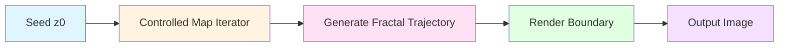
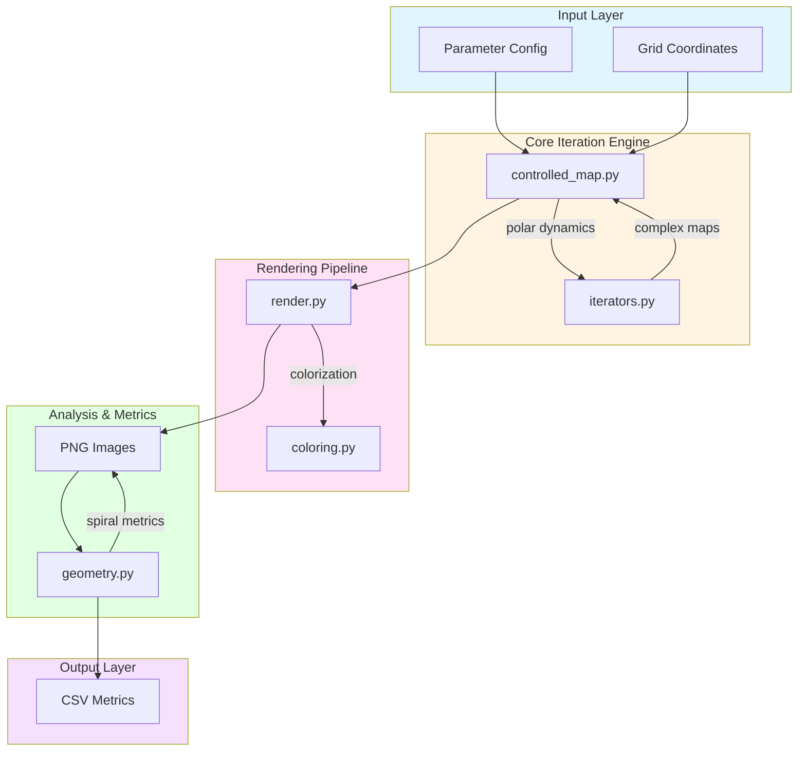
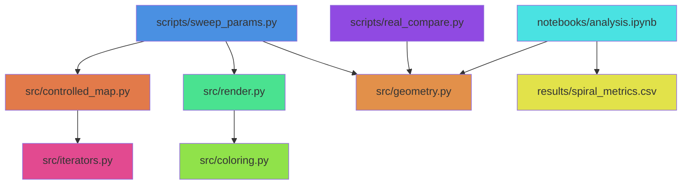
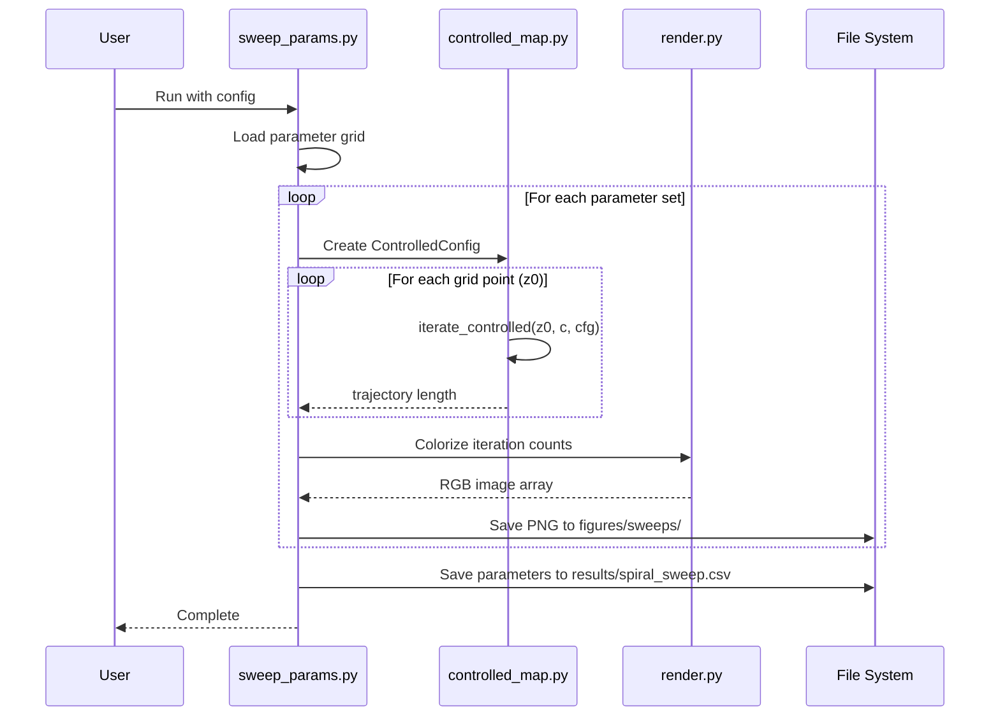
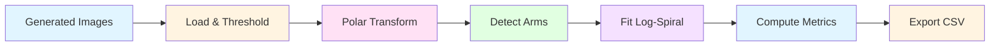

# System Architecture

This document describes the architecture and data flow of the spiral fractals simulation engine.

## High-Level Flow



## Detailed System Architecture



## Module Dependencies



## Data Flow: Parameter Sweep



## Controlled Map Iteration Logic

The core spiral generation happens in `controlled_map.py`:

```
For each iteration:
  1. Extract polar coordinates (r, θ) from z
  2. Apply arm symmetry modulation: arm_mod = 1 + ε·cos(k·θ)
  3. Update radius:
     - Additive: r' = r·(1 + δ·arm_mod)
     - Power: r' = r^α·arm_mod
  4. Update angle: θ' = θ + ω + ε·sin(k·θ + arg(c)) + coupling
  5. Reconstruct: z_spiral = r'·e^(iθ')
  6. Apply chaotic core: z_new = core_step(z_spiral, c)
  7. Check escape condition: |z_new| > R_escape
```

**Key insight**: Polar update happens *before* chaotic core, creating controlled spiral channels with fractal boundaries.

## Analysis Pipeline



The `geometry.py` module analyzes generated spirals to extract:
- **Arm count**: Number of distinct spiral arms
- **Slope b**: Log-spiral parameter from r = a·e^(bθ)
- **R² fit**: Goodness of fit to log-spiral model
- **Fractal dimension**: Box-counting dimension of boundary
- **Arm spacing**: Angular separation between arms

## File Organization

```
src/
├── controlled_map.py    # Core polar dynamics + chaos
├── iterators.py         # Standard complex maps (quadratic, exp)
├── render.py            # Grid iteration + colorization
├── coloring.py          # Color scheme utilities
├── geometry.py          # Spiral analysis metrics
└── utils.py             # Helper functions

scripts/
├── sweep_params.py      # Parameter space exploration
├── generate_showcase.py # High-quality example generation
├── quick_sanity.py      # Thumbnail grid checker
├── real_compare.py      # Real-world spiral matching
└── run_all.py           # One-click pipeline

configs/
├── sweep_small.json     # Quick test sweep
├── sweep_full.json      # Comprehensive sweep
├── controlled_best.json # Best single parameters
└── showcase_spirals.json # Gallery examples
```

## Theoretical Foundation

The controlled map combines two dynamics:

1. **Deterministic spiral growth** (polar coordinates):
   - Radius: r_{n+1} = r_n + δ (additive) or r_n^α (power)
   - Angle: θ_{n+1} = θ_n + ω + perturbations
   
2. **Chaotic boundary** (complex iteration):
   - z_{n+1} = f(z_n) + c where f is quadratic or exponential

**Scaling law**: For additive mode, b ≈ δ/(ω·r₀)

This creates spirals with:
- Predictable large-scale structure (from polar dynamics)
- Fractal fine structure (from chaotic core)
- Tunable parameters matching real-world spirals

## Performance Considerations

- **Grid size**: 256×256 for testing, 512×512 for analysis, 1024×1024 for publication
- **Iterations**: 300-500 typical, higher for tight spirals
- **Parallelization**: Each grid point is independent (future: GPU acceleration)
- **Memory**: O(width × height) for iteration counts and trajectories
- **Disk**: ~100-500 KB per PNG image (compressed)

## Extension Points

Future enhancements could include:

1. **GPU acceleration**: Port `iterate_controlled` to CUDA/OpenCL
2. **Real-time visualization**: Interactive parameter exploration
3. **3D spirals**: Extend to quaternion dynamics
4. **Machine learning**: Train models to predict parameters from real images
5. **Video generation**: Animate parameter transitions
